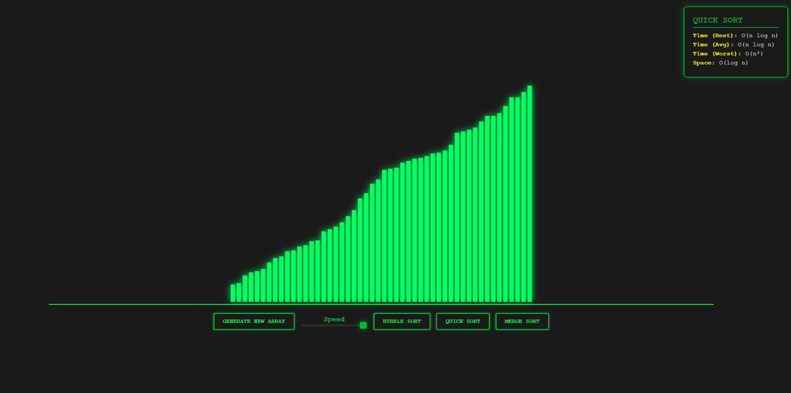

# Sorting Visualizer



A modern, high-performance Sorting Algorithm Visualizer built with **React** and **Vite**. Features a sleek **Cyberpunk aesthetic** with neon colors and dark mode.

## 🚀 Features

- **Algorithmic Animations**:
  - **Bubble Sort**: $O(n^2)$
  - **Quick Sort**: $O(n \log n)$
  - **Merge Sort**: $O(n \log n)$
- **Educational Info**: Real-time display of Time & Space complexity.
- **Interactive Controls**:
  - Adjustable animation speed.
  - Generate new random arrays instantly.
- **Cyberpunk UI**:
  - Dark mode background (`#1a1a1a`).
  - Neon Green bars with glowing effects.
  - Color-coded comparisons (Red) and Sorted states (Neon Green).

## 🛠️ Tech Stack

- **Framework**: React 19
- **Build Tool**: Vite
- **Styling**: Vanilla CSS Modules (Scoped Styles)
- **Language**: JavaScript (ES6+)

## 📦 Getting Started

### Prerequisites
- Node.js (v14 or higher)
- npm

### Installation

1. **Clone the repository**
   ```bash
   git clone https://github.com/your-username/react-sorting-visualizer.git
   cd react-sorting-visualizer
   ```

2. **Install Dependencies**
   ```bash
   npm install
   ```

3. **Run Locally**
   ```bash
   npm run dev
   ```
   Open [http://localhost:5173](http://localhost:5173) in your browser.

## 🤝 Contributing

Contributions are welcome! Please feel free to submit a Pull Request.

## 📄 License

This project is licensed under the [MIT License](LICENSE).
